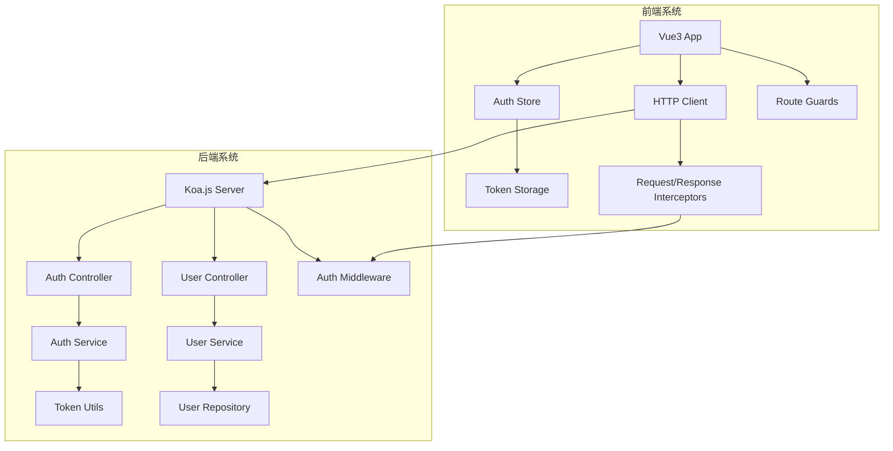
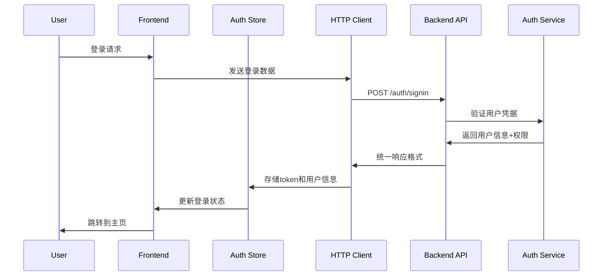
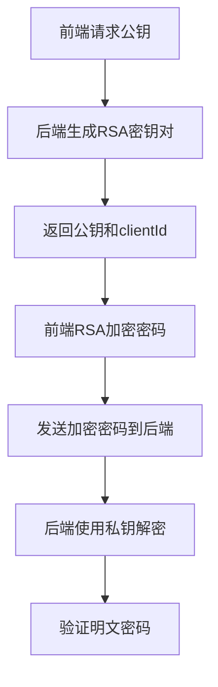
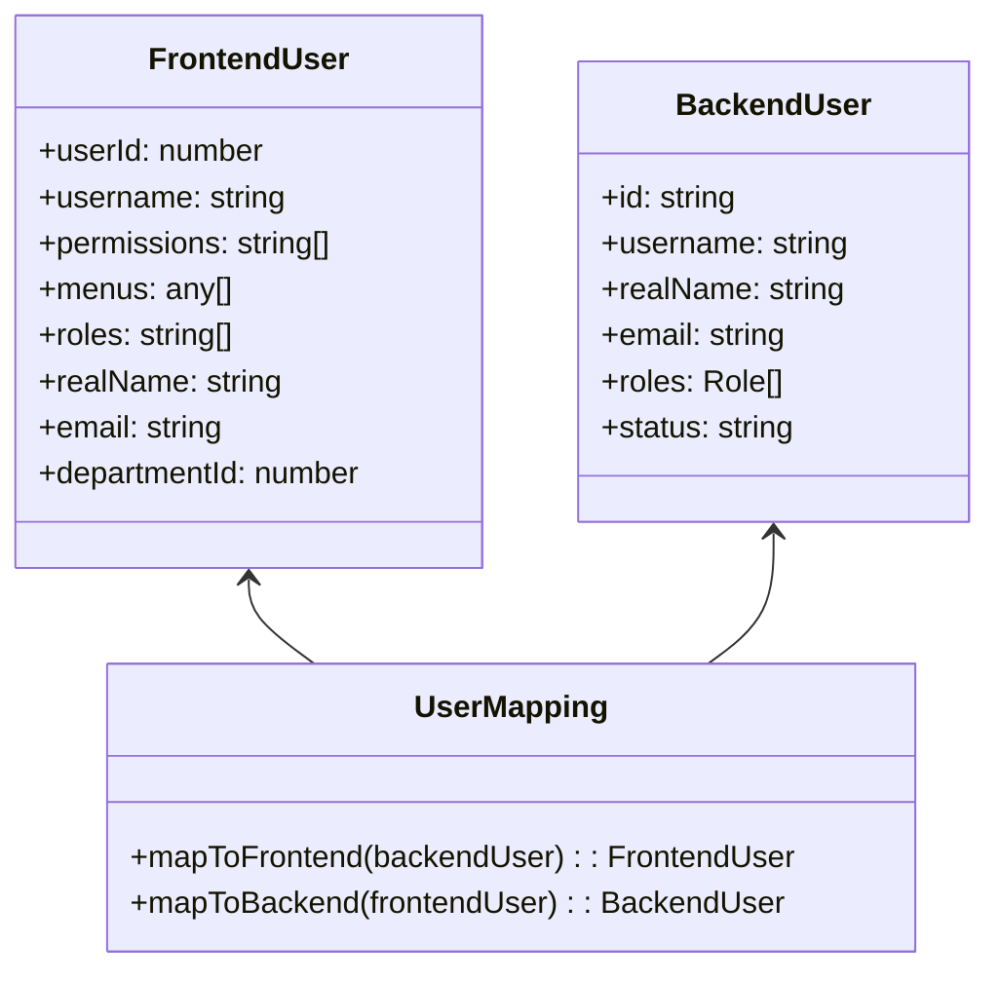
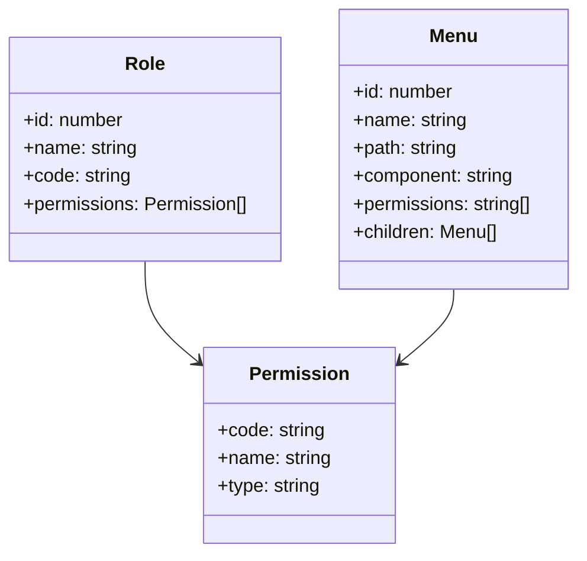
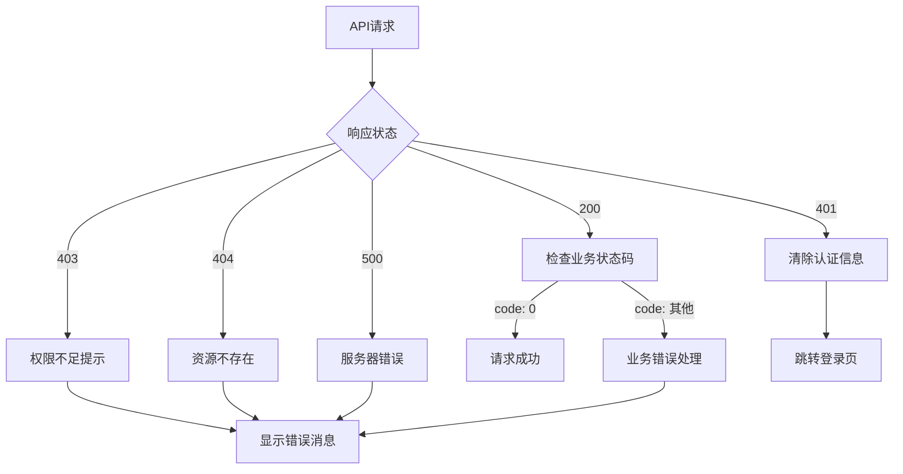

# RBAC系统前后端接口重构设计文档

## 概述

本设计文档旨在解决Vue3+TypeScript+Element Plus RBAC系统中前后端接口不匹配的问题。通过分析现有代码结构，识别出主要问题在于：

1. 前后端接口响应格式不一致（前端期望code为200，后端返回code为0）
2. 登录接口参数结构差异（前端支持RSA加密，后端未完全适配）
3. 用户信息接口返回字段映射不匹配
4. 分页接口参数和响应格式不统一
5. 错误处理和状态码不一致

## 架构

### 系统架构图



### 数据流图



## 组件和接口

### 1. 响应格式标准化

#### 问题分析
- 前端HTTP客户端期望成功响应的code为200或0
- 后端当前返回code为0表示成功
- 需要统一响应格式和错误处理

#### 设计方案
保持后端当前的响应格式（code: 0表示成功），确保前端HTTP客户端正确处理。

**标准响应格式：**
```typescript
interface APIResponse<T = any> {
  code: number    // 0表示成功，其他表示错误
  data: T         // 响应数据
  message: string // 响应消息
}
```

### 2. RSA加密认证系统

#### 问题分析
- 前端有完整的RSA加密实现，支持Web Crypto API和node-forge两种方式
- 后端只有模拟的公钥生成，缺少真正的RSA密钥对生成和解密功能
- 需要实现完整的RSA密钥管理和密码解密功能

#### 设计方案

**RSA密钥管理架构：**


**后端RSA服务设计：**
```typescript
interface RsaKeyPair {
  publicKey: string   // PEM格式公钥
  privateKey: string  // PEM格式私钥
  clientId: string    // 客户端标识
  expiresAt: Date     // 密钥过期时间
}

interface RsaService {
  generateKeyPair(): Promise<RsaKeyPair>
  getPublicKey(clientId?: string): Promise<{publicKey: string, clientId: string}>
  decryptPassword(encryptedPassword: string, clientId: string): Promise<string>
  cleanExpiredKeys(): void
}
```

**前端登录请求类型（RSA加密）：**
```typescript
interface SigninRequest {
  usernameOrEmail: string
  password: string        // RSA加密后的密码
  clientId: string       // RSA密钥标识
  preferredLanguage?: string
}
```

**后端登录响应类型：**
```typescript
interface LoginResponse {
  accessToken: string
  userId: number
  username: string
  permissions: string[]
  menuTree: any[]
  roles: string[]
  realName?: string
  departmentId?: number
  email?: string
  sessionId?: string
}
```

### 3. RSA密钥管理策略

#### 密钥生成和存储
- 使用Node.js crypto模块生成2048位RSA密钥对
- 密钥对临时存储在内存中，设置过期时间（如30分钟）
- 支持多个并发客户端的密钥管理
- 定期清理过期的密钥对

#### 安全考虑
- 私钥仅在服务端内存中存储，不持久化
- 每个客户端会话使用独立的密钥对
- 密钥有效期限制，防止长期暴露
- 解密后立即清除明文密码

### 4. 用户信息接口

#### 问题分析
- 前端getCurrentUser接口期望的字段与后端返回不匹配
- 需要统一字段映射和数据结构

#### 设计方案

**统一用户信息响应：**
```typescript
interface CurrentUserResponse {
  id: number
  username: string
  permissions: string[]
  roles: string[]
  allMenuTree?: any[]
  departmentId?: number
  email?: string
  realName?: string
  phone?: string
  status?: string
  createTime?: string
  updateTime?: string
}
```

### 5. 分页接口标准化

#### 问题分析
- 前后端分页参数和响应格式需要统一
- 确保分页组件能正确处理数据

#### 设计方案

**分页请求参数：**
```typescript
interface PageRequest<T = Record<string, any>> {
  currentPage?: number
  pageSize?: number
  needTotal?: boolean
  orders?: any[]
} & T
```

**分页响应格式：**
```typescript
interface PageResponse<T = Record<string, any>> {
  currentPage: number
  pageSize: number
  totalPage: number
  totalElements: number
  list: T[]
}
```

## 数据模型

### 用户数据模型映射



### 权限数据模型



## 错误处理

### 错误分类和处理策略



### 错误码标准化

| 错误类型 | HTTP状态码 | 业务码 | 描述 |
|---------|-----------|--------|------|
| 成功 | 200 | 0 | 请求成功 |
| 认证失败 | 401 | AUTH_FAILED | 用户名或密码错误 |
| 权限不足 | 403 | PERMISSION_DENIED | 无权限访问 |
| 资源不存在 | 404 | NOT_FOUND | 资源不存在 |
| 参数错误 | 400 | INVALID_PARAMS | 请求参数错误 |
| 服务器错误 | 500 | INTERNAL_ERROR | 内部服务器错误 |

## 测试策略

### 接口测试覆盖

1. **认证接口测试**
   - 登录成功场景
   - 登录失败场景（用户名错误、密码错误、账号被禁用）
   - 登出功能
   - Token刷新

2. **用户信息接口测试**
   - 获取当前用户信息
   - 用户信息更新
   - 权限验证

3. **用户管理接口测试**
   - 用户列表分页查询
   - 用户创建、更新、删除
   - 用户状态管理

4. **权限和路由测试**
   - 动态路由加载
   - 权限验证
   - 菜单生成

### 集成测试场景

1. **完整登录流程测试**
   - 用户登录 → 获取用户信息 → 加载动态路由 → 显示菜单

2. **权限变更测试**
   - 管理员修改用户权限 → 用户重新登录 → 验证新权限生效

3. **会话恢复测试**
   - 页面刷新 → 自动恢复登录状态 → 验证权限和菜单

## 实现优先级

### 高优先级（核心功能）
1. RSA密钥管理服务实现
2. RSA密码解密功能
3. 响应格式标准化
4. 登录认证接口修复
5. 用户信息接口对接
6. 基本错误处理

### 中优先级（重要功能）
1. 分页接口标准化
2. 用户管理接口完善
3. 权限验证优化
4. RSA密钥过期管理

### 低优先级（增强功能）
1. 验证码功能完善
2. 日志记录增强
3. 性能优化

## 性能考虑

1. **缓存策略**
   - 用户信息本地缓存
   - 权限数据缓存
   - 菜单数据缓存

2. **请求优化**
   - 避免重复请求用户信息
   - 合并权限和菜单请求
   - 实现请求防抖

3. **错误恢复**
   - Token自动刷新机制
   - 网络错误重试
   - 优雅降级处理

## 安全考虑

1. **认证安全**
   - Token过期处理
   - 密码加密传输
   - 防止CSRF攻击

2. **权限安全**
   - 前后端双重权限验证
   - 敏感操作二次确认
   - 权限最小化原则

3. **数据安全**
   - RSA密钥安全管理
   - 私钥内存存储，不持久化
   - 敏感信息脱敏
   - 输入参数验证
   - SQL注入防护