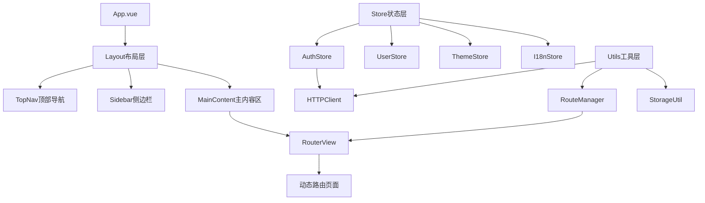
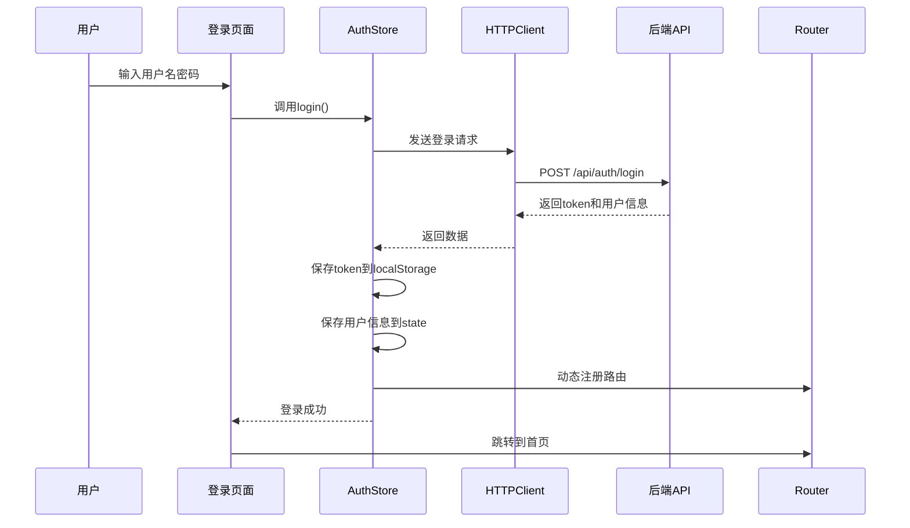
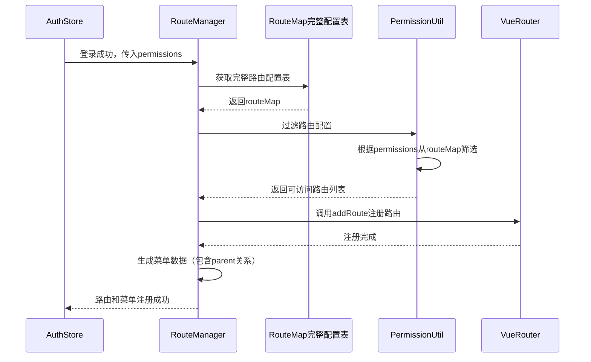

# 设计文档

## 概述

本文档描述Vue3+TypeScript中台前端框架的技术设计方案。该框架采用组合式API、Pinia状态管理、Vue Router路由管理和Vue I18n国际化方案，构建一个模块化、可扩展的企业级前端应用基础架构。

## 技术栈

- **核心框架**: Vue 3.3+ (Composition API)
- **开发语言**: TypeScript 5.0+
- **构建工具**: Vite 5.0+
- **状态管理**: Pinia 2.1+
- **路由管理**: Vue Router 4.2+
- **HTTP客户端**: Axios 1.6+
- **国际化**: Vue I18n 9.8+
- **UI组件库**: Element Plus 2.4+
- **CSS预处理器**: SCSS

## 架构设计

### 整体架构



### 目录结构

```
src/
├── api/                    # API接口定义
│   ├── auth.ts            # 认证相关API
│   └── user.ts            # 用户相关API
├── assets/                # 静态资源
│   ├── styles/            # 全局样式
│   │   ├── variables.scss # CSS变量
│   │   ├── theme.scss     # 主题样式
│   │   └── index.scss     # 入口样式
│   └── icons/             # 图标资源
├── components/            # 公共组件
│   ├── layout/            # 布局组件
│   │   ├── TopNav.vue     # 顶部导航
│   │   ├── Sidebar.vue    # 侧边栏
│   │   └── MainLayout.vue # 主布局
│   └── common/            # 通用组件
├── composables/           # 组合式函数
│   ├── useAuth.ts         # 认证逻辑
│   ├── useTheme.ts        # 主题逻辑
│   └── usePermission.ts   # 权限逻辑
├── locales/               # 国际化语言包
│   ├── zh-CN.ts           # 中文
│   └── en-US.ts           # 英文
├── router/                # 路由配置
│   ├── index.ts           # 路由实例
│   ├── routes.ts          # 路由定义
│   └── guards.ts          # 路由守卫
├── stores/                # Pinia状态管理
│   ├── auth.ts            # 认证状态
│   ├── user.ts            # 用户状态
│   ├── theme.ts           # 主题状态
│   └── menu.ts            # 菜单状态
├── types/                 # TypeScript类型定义
│   ├── api.ts             # API类型
│   ├── user.ts            # 用户类型
│   ├── route.ts           # 路由类型
│   └── menu.ts            # 菜单类型
├── utils/                 # 工具函数
│   ├── http.ts            # HTTP封装
│   ├── storage.ts         # 本地存储
│   ├── permission.ts      # 权限工具
│   └── route.ts           # 路由工具
├── views/                 # 页面组件
│   ├── login/             # 登录页
│   │   └── index.vue
│   ├── home/              # 首页
│   │   └── index.vue
│   ├── error/             # 错误页面
│   │   ├── 403.vue
│   │   └── 404.vue
│   └── ...                # 其他业务页面
├── App.vue                # 根组件
└── main.ts                # 入口文件
```

## 核心模块设计

### 1. HTTP请求封装模块 (HTTPClient)

#### 设计要点

- 基于Axios创建实例，配置baseURL和timeout
- 实现请求拦截器：自动添加token、设置请求头
- 实现响应拦截器：统一处理响应格式、错误处理
- 提供类型安全的请求方法封装

#### 接口设计

```typescript
interface HTTPClientConfig {
  baseURL: string;
  timeout: number;
  headers?: Record<string, string>;
}

interface APIResponse<T = any> {
  code: number;
  data: T;
  message: string;
}

class HTTPClient {
  get<T>(url: string, params?: any): Promise<T>
  post<T>(url: string, data?: any): Promise<T>
  put<T>(url: string, data?: any): Promise<T>
  delete<T>(url: string, params?: any): Promise<T>
}
```

#### 拦截器逻辑

**请求拦截器**:
1. 从localStorage读取token
2. 如果token存在，添加到Authorization header
3. 设置Content-Type为application/json
4. 返回配置对象

**响应拦截器**:
1. 检查HTTP状态码
2. 如果是401，清除token并跳转登录页
3. 如果是其他错误码，显示错误提示
4. 提取response.data返回
5. 统一错误处理和提示

### 2. 用户认证模块 (AuthModule)

#### 设计要点

- 使用Pinia Store管理认证状态
- Token存储在localStorage，支持持久化
- 提供登录、登出、刷新token等方法
- 集成路由守卫实现页面访问控制

#### 状态设计

```typescript
interface AuthState {
  token: string | null;
  userInfo: UserInfo | null;
  isAuthenticated: boolean;
}

interface UserInfo {
  id: string;
  username: string;
  nickname: string;
  avatar?: string;
  roles: string[];
  permissions: string[];
}
```

#### 核心方法

```typescript
interface AuthStore {
  // 状态
  token: string | null
  userInfo: UserInfo | null
  isAuthenticated: boolean
  
  // 方法
  login(username: string, password: string): Promise<void>
  logout(): Promise<void>
  refreshToken(): Promise<void>
  getUserInfo(): Promise<UserInfo>
  checkAuth(): boolean
  restoreAuth(): void
}
```

#### 登录流程



### 3. 动态路由管理模块 (RouteManager)

#### 设计要点

- 区分静态路由（公共页面）和动态路由（权限页面）
- 根据用户权限过滤可访问路由
- 使用addRoute动态注册路由
- 实现路由懒加载优化性能

#### 路由配置结构

```typescript
interface RouteConfig {
  path: string;
  name: string;
  component: () => Promise<any>;
  meta: RouteMeta;
  children?: RouteConfig[];
}

interface RouteMeta {
  title: string;
  icon?: string;
  requiresAuth: boolean;
  permissions?: string[];
  roles?: string[];
  hidden?: boolean;
  keepAlive?: boolean;
  parent?: string;           // 父级路由name，用于追溯层级关系
  order?: number;            // 排序权重
}
```

#### 完整路由配置表

系统维护一个完整的路由配置表（routeMap），包含所有可能的路由信息。用户登录后，根据其权限从配置表中过滤出可访问的路由，然后动态注册到Vue Router中。

```typescript
// 完整路由配置表示例
const routeMap: RouteConfig[] = [
  {
    path: '/dashboard',
    name: 'Dashboard',
    component: () => import('@/views/dashboard/index.vue'),
    meta: {
      title: '工作台',
      icon: 'dashboard',
      requiresAuth: true,
      permissions: ['dashboard:view']
    }
  },
  {
    path: '/system',
    name: 'System',
    component: () => import('@/views/system/index.vue'),
    meta: {
      title: '系统管理',
      icon: 'system',
      requiresAuth: true,
      permissions: ['system:view']
    },
    children: [
      {
        path: 'user',
        name: 'SystemUser',
        component: () => import('@/views/system/user/index.vue'),
        meta: {
          title: '用户管理',
          icon: 'user',
          requiresAuth: true,
          permissions: ['system:user:view'],
          parent: 'System'
        }
      },
      {
        path: 'role',
        name: 'SystemRole',
        component: () => import('@/views/system/role/index.vue'),
        meta: {
          title: '角色管理',
          icon: 'role',
          requiresAuth: true,
          permissions: ['system:role:view'],
          parent: 'System'
        }
      }
    ]
  }
]
```

#### 路由类型

**静态路由** (始终可访问):
- `/login` - 登录页
- `/404` - 404页面
- `/403` - 无权限页面

**动态路由** (根据权限加载):
- 业务功能页面
- 根据用户permissions字段过滤

#### 路由守卫逻辑

```typescript
router.beforeEach((to, from, next) => {
  const authStore = useAuthStore()
  
  // 1. 检查是否需要认证
  if (to.meta.requiresAuth) {
    // 2. 检查是否已登录
    if (!authStore.isAuthenticated) {
      next('/login')
      return
    }
    
    // 3. 检查权限
    if (to.meta.permissions) {
      const hasPermission = checkPermission(to.meta.permissions)
      if (!hasPermission) {
        next('/403')
        return
      }
    }
  }
  
  next()
})
```

#### 动态路由注册流程



### 4. 国际化模块 (I18nModule)

#### 设计要点

- 使用Vue I18n实现多语言支持
- 语言包按模块组织，支持按需加载
- 语言偏好存储在localStorage
- 提供全局$t函数和useI18n组合式函数

#### 语言包结构

```typescript
interface LocaleMessages {
  common: {
    login: string;
    logout: string;
    submit: string;
    cancel: string;
    // ...
  };
  menu: {
    home: string;
    dashboard: string;
    // ...
  };
  validation: {
    required: string;
    email: string;
    // ...
  };
}
```

#### 配置方式

```typescript
const i18n = createI18n({
  legacy: false,
  locale: getStoredLocale() || 'zh-CN',
  fallbackLocale: 'zh-CN',
  messages: {
    'zh-CN': zhCN,
    'en-US': enUS
  }
})
```

#### 使用方式

```typescript
// 组件中使用
const { t, locale } = useI18n()

// 切换语言
const changeLanguage = (lang: string) => {
  locale.value = lang
  localStorage.setItem('locale', lang)
}
```

### 5. 导航系统 (NavigationSystem)

#### 设计要点

- 顶部导航显示一级菜单
- 侧边栏显示当前一级菜单下的二级菜单
- 菜单数据根据路由配置和权限动态生成
- 支持菜单折叠、高亮、图标显示

#### 菜单数据结构

```typescript
interface MenuItem {
  id: string;
  title: string;
  icon?: string;
  path?: string;
  name: string;              // 路由name
  parent?: string;           // 父级菜单name
  children?: MenuItem[];
  permissions?: string[];
  hidden?: boolean;
  order?: number;            // 排序
  level: number;             // 层级：1-顶部导航，2-侧边栏一级，3-侧边栏二级
}
```

#### 组件设计

**TopNav组件**:
- 显示一级菜单项
- 点击切换当前激活的一级菜单
- 高亮当前路由对应的一级菜单
- 右侧显示用户信息、语言切换、主题切换

**Sidebar组件**:
- 显示当前一级菜单下的二级菜单
- 支持多级嵌套菜单的折叠/展开
- 点击菜单项进行路由跳转
- 高亮当前路由及其父级路由
- 根据parent字段追溯层级关系

#### 菜单生成逻辑

```typescript
// 从完整路由配置表生成菜单
const generateMenus = (routes: RouteConfig[], permissions: string[]): MenuItem[] => {
  return routes
    .filter(route => !route.meta?.hidden)
    .filter(route => hasPermission(route.meta?.permissions, permissions))
    .map(route => ({
      id: route.name,
      name: route.name,
      title: route.meta.title,
      icon: route.meta.icon,
      path: route.path,
      parent: route.meta.parent,
      level: calculateLevel(route),
      order: route.meta.order || 0,
      children: route.children ? generateMenus(route.children, permissions) : undefined
    }))
    .sort((a, b) => a.order - b.order)
}

// 计算菜单层级
const calculateLevel = (route: RouteConfig): number => {
  if (!route.meta.parent) return 1  // 顶部导航
  const parent = findRouteByName(route.meta.parent)
  if (!parent?.meta.parent) return 2  // 侧边栏一级
  return 3  // 侧边栏二级或更深
}

// 根据当前路由获取面包屑路径
const getBreadcrumb = (routeName: string, menuList: MenuItem[]): MenuItem[] => {
  const breadcrumb: MenuItem[] = []
  let current = findMenuByName(routeName, menuList)
  
  while (current) {
    breadcrumb.unshift(current)
    if (current.parent) {
      current = findMenuByName(current.parent, menuList)
    } else {
      break
    }
  }
  
  return breadcrumb
}
```

#### 侧边栏展开/折叠状态管理

```typescript
interface SidebarState {
  collapsed: boolean;           // 侧边栏是否折叠
  openedMenus: string[];        // 当前展开的菜单name列表
}

// 切换子菜单展开状态
const toggleSubmenu = (menuName: string) => {
  const index = openedMenus.indexOf(menuName)
  if (index > -1) {
    openedMenus.splice(index, 1)  // 折叠
  } else {
    openedMenus.push(menuName)     // 展开
  }
}

// 根据当前路由自动展开父级菜单
const autoExpandMenus = (routeName: string) => {
  const breadcrumb = getBreadcrumb(routeName, menuList)
  openedMenus = breadcrumb.map(item => item.name)
}
```

### 6. 主题切换模块 (ThemeModule)

#### 设计要点

- 使用CSS变量实现主题切换
- 预设多套主题色方案
- 主题偏好存储在localStorage
- 动态修改document根元素的CSS变量

#### 主题配置

```typescript
interface ThemeConfig {
  name: string;
  label: string;
  colors: {
    primary: string;
    success: string;
    warning: string;
    danger: string;
    info: string;
    // ...
  };
}

const themes: ThemeConfig[] = [
  {
    name: 'default',
    label: '默认蓝',
    colors: {
      primary: '#409EFF',
      success: '#67C23A',
      warning: '#E6A23C',
      danger: '#F56C6C',
      info: '#909399'
    }
  },
  {
    name: 'green',
    label: '清新绿',
    colors: {
      primary: '#00C853',
      // ...
    }
  },
  {
    name: 'purple',
    label: '优雅紫',
    colors: {
      primary: '#9C27B0',
      // ...
    }
  }
]
```

#### 主题切换实现

```typescript
const applyTheme = (theme: ThemeConfig) => {
  const root = document.documentElement
  Object.entries(theme.colors).forEach(([key, value]) => {
    root.style.setProperty(`--color-${key}`, value)
  })
  localStorage.setItem('theme', theme.name)
}
```

### 7. 登录页面

#### 设计要点

- 简洁的居中布局
- 表单验证
- 加载状态显示
- 错误提示
- 响应式设计

#### 组件结构

```vue
<template>
  <div class="login-container">
    <div class="login-box">
      <h1 class="login-title">{{ t('login.title') }}</h1>
      <el-form :model="form" :rules="rules" ref="formRef">
        <el-form-item prop="username">
          <el-input v-model="form.username" :placeholder="t('login.username')" />
        </el-form-item>
        <el-form-item prop="password">
          <el-input v-model="form.password" type="password" :placeholder="t('login.password')" />
        </el-form-item>
        <el-form-item>
          <el-button type="primary" :loading="loading" @click="handleLogin">
            {{ t('login.submit') }}
          </el-button>
        </el-form-item>
      </el-form>
    </div>
  </div>
</template>
```

#### 表单验证规则

```typescript
const rules = {
  username: [
    { required: true, message: t('validation.required'), trigger: 'blur' }
  ],
  password: [
    { required: true, message: t('validation.required'), trigger: 'blur' },
    { min: 6, message: t('validation.minLength', { min: 6 }), trigger: 'blur' }
  ]
}
```

## 数据模型

### 用户信息模型

```typescript
interface UserInfo {
  id: string;
  username: string;
  nickname: string;
  avatar?: string;
  email?: string;
  phone?: string;
  roles: string[];
  permissions: string[];
  createdAt: string;
  updatedAt: string;
}
```

### 登录请求/响应模型

```typescript
interface LoginRequest {
  username: string;
  password: string;
}

interface LoginResponse {
  token: string;
  refreshToken?: string;
  expiresIn: number;
  userInfo: UserInfo;
}
```

### 路由元信息模型

```typescript
interface RouteMeta {
  title: string;              // 页面标题
  icon?: string;              // 菜单图标
  requiresAuth: boolean;      // 是否需要认证
  permissions?: string[];     // 所需权限
  roles?: string[];           // 所需角色
  hidden?: boolean;           // 是否在菜单中隐藏
  keepAlive?: boolean;        // 是否缓存页面
  affix?: boolean;            // 是否固定在标签页
  breadcrumb?: boolean;       // 是否显示面包屑
}
```

## 错误处理

### HTTP错误处理

```typescript
const errorHandler = (error: AxiosError) => {
  const { response } = error
  
  if (response) {
    switch (response.status) {
      case 401:
        // 未授权，清除token并跳转登录
        authStore.logout()
        router.push('/login')
        ElMessage.error('登录已过期，请重新登录')
        break
      case 403:
        // 无权限
        ElMessage.error('无权限访问')
        router.push('/403')
        break
      case 404:
        ElMessage.error('请求的资源不存在')
        break
      case 500:
        ElMessage.error('服务器错误')
        break
      default:
        ElMessage.error(response.data?.message || '请求失败')
    }
  } else {
    ElMessage.error('网络错误，请检查网络连接')
  }
  
  return Promise.reject(error)
}
```

### 路由错误处理

```typescript
router.onError((error) => {
  console.error('路由错误:', error)
  ElMessage.error('页面加载失败')
})
```

### 全局错误处理

```typescript
app.config.errorHandler = (err, instance, info) => {
  console.error('全局错误:', err, info)
  ElMessage.error('应用发生错误')
}
```

## 测试策略

### 单元测试

- 使用Vitest作为测试框架
- 测试工具函数（http.ts, storage.ts, permission.ts）
- 测试Pinia Store的actions和getters
- 测试组合式函数（composables）

### 组件测试

- 使用@vue/test-utils进行组件测试
- 测试登录页面表单验证和提交逻辑
- 测试导航组件的交互行为
- 测试主题切换功能

### E2E测试

- 使用Playwright进行端到端测试
- 测试完整的登录流程
- 测试权限控制和路由跳转
- 测试多语言切换
- 测试主题切换

### 测试覆盖率目标

- 工具函数: 90%+
- Store: 80%+
- 组件: 70%+
- 整体: 75%+

## 性能优化

### 代码分割

- 路由懒加载：使用动态import
- 组件懒加载：大型组件按需加载
- 第三方库按需引入（如Element Plus）

### 缓存策略

- 使用keep-alive缓存页面组件
- localStorage缓存用户信息和配置
- HTTP请求缓存（适当场景）

### 打包优化

- 使用Vite的代码分割功能
- 压缩静态资源
- 使用CDN加载第三方库
- Tree-shaking移除未使用代码

## 安全考虑

### XSS防护

- 使用Vue的模板语法自动转义
- 避免使用v-html渲染用户输入
- CSP策略配置

### CSRF防护

- 使用token验证
- SameSite Cookie设置

### 敏感信息保护

- Token存储使用httpOnly Cookie（可选）
- 避免在URL中传递敏感信息
- 生产环境移除console.log

## 部署方案

### 构建配置

```typescript
// vite.config.ts
export default defineConfig({
  build: {
    outDir: 'dist',
    sourcemap: false,
    rollupOptions: {
      output: {
        manualChunks: {
          'vue-vendor': ['vue', 'vue-router', 'pinia'],
          'element-plus': ['element-plus'],
          'utils': ['axios', 'vue-i18n']
        }
      }
    }
  }
})
```

### 环境配置

- 开发环境：.env.development
- 生产环境：.env.production
- 测试环境：.env.test

### 部署流程

1. 执行`npm run build`构建生产版本
2. 将dist目录部署到静态服务器（Nginx/Apache）
3. 配置反向代理处理API请求
4. 配置HTTPS证书
5. 配置Gzip压缩

## 扩展性设计

### 插件机制

- 支持自定义插件扩展功能
- 提供插件注册接口
- 插件生命周期钩子

### 主题定制

- 支持自定义主题色
- 支持暗黑模式
- 支持自定义组件样式

### 权限扩展

- 支持细粒度权限控制
- 支持按钮级权限
- 支持数据权限过滤

## 开发规范

### 代码规范

- ESLint + Prettier代码格式化
- TypeScript严格模式
- 组件命名采用PascalCase
- 文件命名采用kebab-case

### Git规范

- 使用Conventional Commits规范
- 分支管理：main/develop/feature/bugfix
- Code Review流程

### 文档规范

- 组件文档使用JSDoc
- API文档使用OpenAPI规范
- README包含快速开始指南
