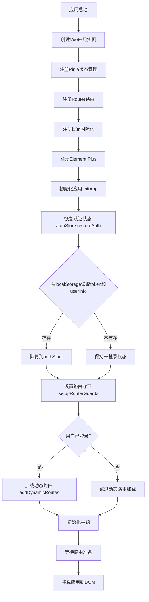
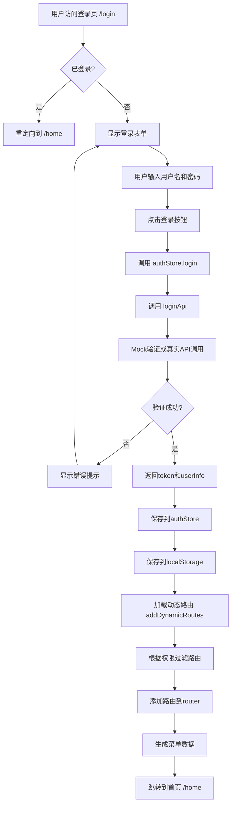
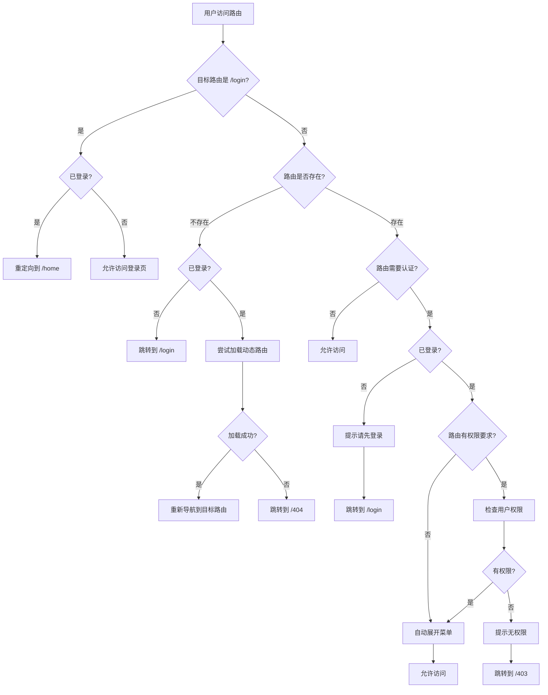
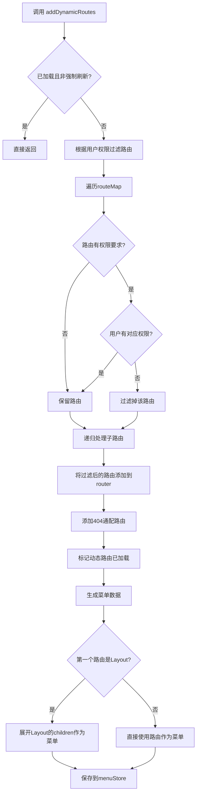
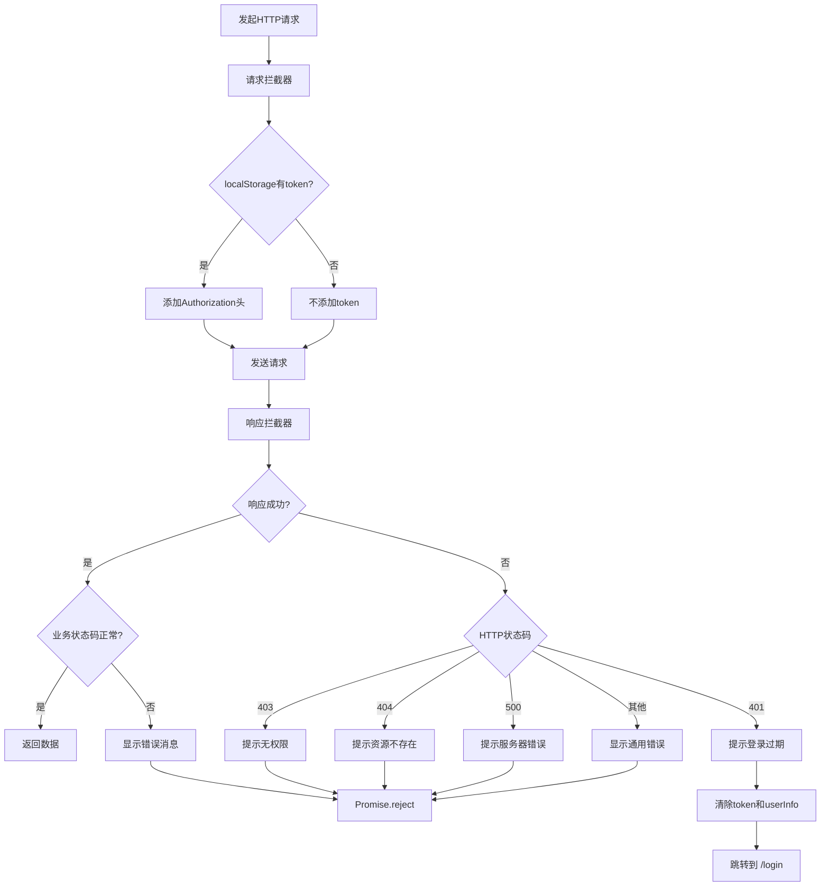
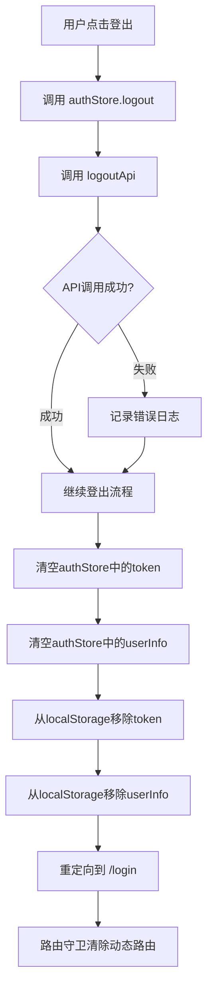
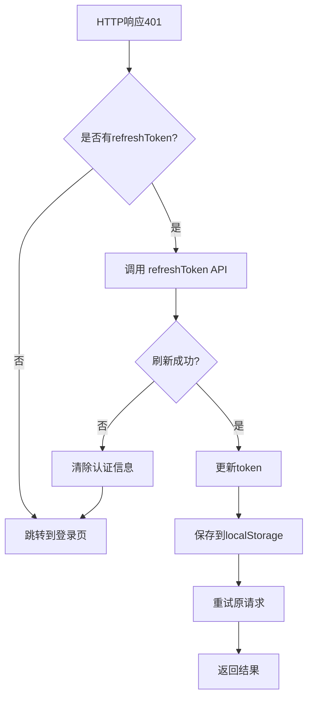
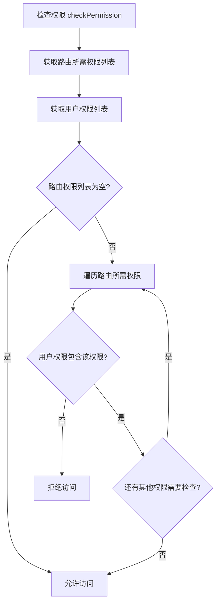
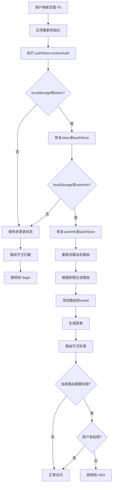

# 用户认证与路由流程图

本文档详细说明了系统中用户登录、认证、路由守卫、动态路由加载等核心流程的逻辑走向。

## 1. 应用初始化流程

## 2. 用户登录流程

## 3. 路由守卫流程

## 4. 动态路由加载流程

## 5. HTTP请求拦截流程

## 6. 用户登出流程

## 7. Token刷新流程（预留）

## 8. 权限检查流程

## 9. 页面刷新恢复状态流程

## 核心要点总结

### 认证状态持久化
- 使用 `localStorage` 存储 `token` 和 `userInfo`
- 应用初始化时通过 `restoreAuth()` 恢复状态
- 页面刷新后自动恢复登录状态

### 动态路由机制
- 登录成功后根据用户权限动态加载路由
- 使用 `router.addRoute()` 动态添加路由
- 路由守卫中处理404情况，尝试加载动态路由

### 权限控制
- 路由级别：通过 `meta.permissions` 定义所需权限
- 路由守卫：在访问前检查用户是否有对应权限
- 菜单生成：只显示用户有权限访问的菜单项

### HTTP拦截
- 请求拦截：自动添加 `Authorization` 头
- 响应拦截：统一处理401（未登录）、403（无权限）等错误
- 401错误自动清除认证信息并跳转登录页

### 安全机制
- Token过期自动跳转登录页
- 未登录用户访问受保护路由自动重定向
- 无权限访问跳转403页面
- 登出时彻底清除本地认证信息
